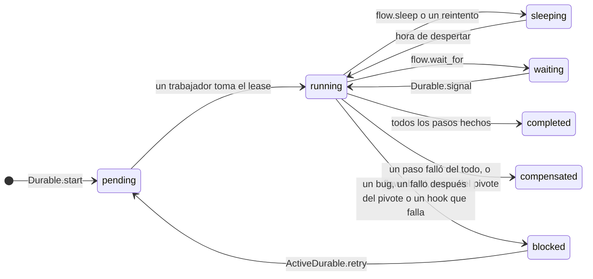

<p align="center"><a href="README.md">English</a> · <b>Español</b></p>

<p align="center">
  
</p>

<p align="center">
  <a href="https://github.com/webresstudio/active_durable/actions/workflows/main.yml"></a>
  
  
  
  
  <a href="LICENSE.txt"></a>
  <a href="https://webresstudio.github.io/active_durable/?lang=es"></a>
</p>

<p align="center">
  <a href="https://webresstudio.github.io/active_durable/?lang=es"><b>Sitio</b></a> ·
  <a href="#inicio-rápido">Inicio rápido</a> ·
  <a href="#en-una-app-rails">En una app Rails</a> ·
  <a href="#cómo-funciona">Cómo funciona</a> ·
  <a href="#las-piezas">Las piezas</a> ·
  <a href="#dashboard">Dashboard</a> ·
  <a href="#pruebas-el-probador-de-apagones">Probador de apagones</a> ·
  <a href="#compatibilidad">Compatibilidad</a> ·
  <a href="https://rubydoc.info/gems/active_durable">Referencia de la API</a>
</p>

---

Una compra aparta stock, cobra una tarjeta, despacha un paquete y envía un email. `ActiveRecord::Base.transaction`
puede revertir tus tablas, pero **un ROLLBACK no llega hasta Stripe**. Si el servidor muere después del cobro, o la
paquetería rechaza el envío, te quedas con el dinero cobrado y sin pedido.

**ActiveDurable** convierte ese flujo en una saga durable guardada en tu propia base de datos:

- **Nada se hace dos veces.** Cada paso terminado queda anotado. Después de un apagón, otro trabajador sigue donde
  se quedó el primero.
- **Nada queda a medias.** Si un paso falla sin remedio, los pasos que terminaron se deshacen, el último primero.
- **Hay cosas que no se pueden deshacer.** Marca el punto de no retorno; después de él, los pasos se reintentan.
- **Nada extra que mantener.** Active Record y Active Job: sin Redis ni servidor de workflows.

## Míralo en acción

<p align="center">
  
</p>

<p align="center">
  
</p>

## Inicio rápido

```bash
bundle add active_durable
bin/rails generate active_durable:install
bin/rails db:migrate
```

Escribe la receta una vez, en `app/sagas/`:

```ruby
# app/sagas/checkout_saga.rb
CheckoutSaga = Durable.define(:checkout) do |flow, order_id:|
  order = Order.find(order_id)
  flow.on(:compensated) { order.update!(status: "cancelled") } # cuando todo lo terminado ya se deshizo

  # Solo toca tu base de datos: se confirma junto con su anotación, así que ocurre exactamente una vez.
  flow.transaction :reserve_stock, undo: -> { order.release_stock! } do
    order.reserve_stock!
    { "reserved" => true }
  end

  # Habla con el mundo de fuera: el ticket es una llave de idempotencia que nunca cambia para este paso.
  payment = flow.step :charge, undo: ->(charge, ticket) { Payments.refund(charge, ticket) } do |ticket|
    Payments.charge(order, ticket)
  rescue Payments::CardDeclined => e
    flow.abort!(e.message) # una tarjeta rechazada no se reintenta: el stock se libera en seguida
  end

  # El punto de no retorno: antes de él los fallos se deshacen, después los pasos se reintentan.
  flow.pivot :dispatch do |ticket|
    { "tracking" => Carrier.ship(order.id, reference: ticket).tracking_number, "payment" => payment["id"] }
  end
  flow.transaction(:mark_shipped) { order.update!(status: "shipped") } # tu propio estado, para tus páginas

  flow.step(:confirmation_email) { OrderMailer.shipped(order.id).deliver_now && true }
  flow.sleep(:wait_for_delivery, 3.days) # ningún trabajador queda ocupado mientras duerme
  flow.step(:ask_for_review) { ReviewMailer.ask(order.id).deliver_now && true }
end
```

Las llamadas a Stripe viven en un módulo normal, con el hacer y el deshacer uno junto al otro. La receta les pasa el
ticket:

```ruby
# app/services/payments.rb
module Payments
  class CardDeclined < StandardError; end

  def self.charge(order, ticket)
    intent = Stripe::PaymentIntent.create(
      { amount: order.total_cents, currency: "usd", customer: order.user.stripe_id, confirm: true },
      { idempotency_key: ticket }
    )
    { "id" => intent.id } # se anota en el cuaderno, así que debe caber en JSON
  rescue Stripe::CardError => e
    raise CardDeclined, e.message # la receta habla tu idioma, no el de Stripe
  end

  def self.refund(charge, ticket)
    Stripe::Refund.create({ payment_intent: charge["id"] }, { idempotency_key: ticket })
  end
end
```

Iníciala en la misma transacción que crea el pedido. La saga se guarda junto con el pedido y el trabajo se encola
solo después del COMMIT, así que un apagón entre medio no la pierde:

```ruby
Order.transaction do
  order = Order.create!(order_params)
  Durable.start(:checkout, order_id: order.id)
end
```

Para correrla de verdad, con un backend de jobs, el barrendero, el initializer, el dashboard y las pruebas, sigue
[En una app Rails](#en-una-app-rails).

> `Durable` es un alias corto de `ActiveDurable`. No se define si tu app ya tiene una constante `Durable`.

## En una app Rails

Todo lo que necesita una app Rails, en orden. Los pasos 1 a 5 se hacen una vez; el paso 6 es el código que escribes
para cada saga.

### 1. Instalar

Corre los tres comandos del [inicio rápido](#inicio-rápido). La migración crea `durable_executions`,
`durable_steps` y `durable_signals` en tu **base de datos principal**, junto a tus modelos: `flow.transaction`
ocurre exactamente una vez solo porque el cuaderno y tus datos se confirman juntos. Una cola en su propia base de
datos, como la de Solid Queue en Rails 8, no es problema.

Cuando actualices la gema, corre `bin/rails generate active_durable:upgrade` y luego `bin/rails db:migrate`: agrega
solo las migraciones que le faltan a tu app, y correrlo dos veces no cambia nada.

### 2. Un backend de jobs

ActiveDurable corre sobre Active Job, así que usa el backend que ya tienes. Las apps nuevas de Rails 8 traen Solid
Queue; en apps anteriores, `bundle add solid_queue` y `bin/rails solid_queue:install` escriben estas líneas. Con
Sidekiq o GoodJob, pon su adaptador.

```ruby
# config/environments/production.rb
config.active_job.queue_adapter = :solid_queue
config.solid_queue.connects_to = { database: { writing: :queue } }
```

- **Los workers deben escuchar la cola de las sagas.** Es `:default` salvo que cambies `config.queue_name`; si la
  cambias, agrégala a tus workers (`config/queue.yml` en Solid Queue, `-q` en Sidekiq).
- **En desarrollo** el adaptador `:async` que Rails trae por defecto guarda cada job en la memoria del proceso que lo
  encoló. El servidor corre los suyos, con sleeps y reintentos incluidos, pero una saga arrancada desde la consola,
  `bin/rails runner`, una tarea rake o `db/seeds.rb` se pierde cuando ese proceso termina, y las esperas programadas
  se pierden cuando el servidor se reinicia. Un minuto después, `bin/rails active_durable:sweep` las recoge: con
  `:async` las corre ahí mismo. O usa Solid Queue también en desarrollo, para que los jobs vivan en la base de datos:
  dale a `development` una base `queue` en `config/database.yml` (como la que tiene `production`, con
  `migrations_paths: db/queue_migrate`), agrega las dos líneas de abajo, corre `bin/rails db:prepare` y arranca
  `bin/jobs` junto al servidor.

```ruby
# config/environments/development.rb
config.active_job.queue_adapter = :solid_queue
config.solid_queue.connects_to = { database: { writing: :queue } }
```

### 3. El barrendero

La red de seguridad: cada minuto encola las ejecuciones que perdieron su job, porque el proceso murió entre el
COMMIT y el encolado o un worker murió con el lease tomado. Con Solid Queue, agrega estas entradas dentro de la clave
`production:` que Rails ya escribió en `config/recurring.yml` (una segunda clave `production:` la reemplazaría sin
avisar), y también bajo una clave `development:` si usas Solid Queue en desarrollo:

```yaml
# config/recurring.yml
production:
  active_durable_sweep:
    class: ActiveDurable::SweepJob
    schedule: every minute
  active_durable_prune:
    class: ActiveDurable::PruneJob
    schedule: every day at 4am
```

Con otro backend, programa `ActiveDurable::SweepJob` en su propio planificador (GoodJob cron, sidekiq-cron), o corre
`bin/rails active_durable:sweep` desde cron.

La segunda entrada es la limpieza: las ejecuciones terminadas (completadas, deshechas o reemplazadas) se guardan
durante `config.keep_finished_for`, 30 días por defecto, y luego `ActiveDurable::PruneJob` las borra junto con su
cuaderno. Las activas y las bloqueadas nunca se borran. Sin ella, cada saga se queda en la base de datos para siempre.

### 4. El initializer

Las opciones, con su valor por defecto:

```ruby
# config/initializers/active_durable.rb
ActiveDurable.configure do |config|
  config.queue_name = :default          # la cola de ActiveDurable::RunJob y SweepJob
  config.lease_duration = 5.minutes     # más largo que tu paso más lento
  config.step_attempts = 3              # antes del pivote; luego se deshace
  config.after_pivot_attempts = 25      # después del pivote; luego se bloquea
  config.undo_attempts = 10             # luego se bloquea
  config.backoff = ->(attempt) { [2**attempt, 3600].min } # o [5, 30, 300], o un número
  config.parallel_concurrency = 4       # hilos por flow.parallel
  config.sweep_grace = 1.minute         # el barrendero no toca ejecuciones más recientes que esto
  config.keep_finished_for = 30.days    # luego ActiveDurable::PruneJob borra las terminadas

  # Quién puede abrir el dashboard fuera de development y test. Con Devise (HTTP basic auth: ver Dashboard):
  config.dashboard_authorize = ->(controller) { controller.request.env["warden"]&.user&.admin? }
end

# Avisa a alguien cuando una saga necesita a una persona.
ActiveSupport::Notifications.subscribe("blocked.active_durable") do |event|
  Sentry.capture_message("Saga blocked", extra: event.payload)
end
```

Para trazas, ve [OpenTelemetry](#observabilidad).

### 5. Rutas

```ruby
# config/routes.rb
mount ActiveDurable::Engine => "/durable"
```

### 6. Tu código

Cada receta vive en `app/sagas/<nombre>_saga.rb` y se asigna a `<Nombre>Saga`, así un worker puede cargar
`:checkout` desde `CheckoutSaga` por su nombre.

```text
app/
  sagas/checkout_saga.rb            la receta
  services/payments.rb              cobrar y reembolsar, uno junto al otro
  services/place_order.rb           crea el pedido y arranca la saga
  controllers/orders_controller.rb  llama a PlaceOrder y responde en seguida
```

El controller nunca llama a Stripe. Arranca la saga y responde al instante; un job corre los pasos.

```ruby
# app/services/place_order.rb
class PlaceOrder
  def self.call(params)
    Order.transaction do
      order = Order.create!(params)
      Durable.start(:checkout, id: "checkout-#{order.id}", order_id: order.id)
      order
    end
  end
end

# app/controllers/orders_controller.rb
class OrdersController < ApplicationController
  def create
    redirect_to PlaceOrder.call(order_params)
  end

  def show
    @order = Order.find(params[:id])
  end
end

# app/models/order.rb: orders tiene una columna status ("placed" por defecto) que la saga actualiza
class Order < ApplicationRecord
  def checkout
    Durable.find("checkout-#{id}")
  end
end
```

El `id:` une la saga a su pedido: `order.checkout` es para tu equipo y el dashboard. La página muestra el estado propio
del pedido, que la saga escribe al avanzar (`mark_shipped`, `flow.on(:compensated)`), no el de la saga: un pedido ya
enviado todavía tiene una saga durmiendo tres días antes de pedir la reseña.

```erb
<%# app/views/orders/show.html.erb %>
<% case @order.status %>
<% when "shipped" %>   Tu pedido va en camino.
<% when "cancelled" %> No pudimos completarlo y te devolvimos el dinero.
<% else %>             Procesando…
<% end %>
```

El cliente no ve «tarjeta rechazada» en la misma respuesta: la página dice «Procesando…» y se actualiza sola con
polling o Turbo Streams. A cambio, a nadie se le cobra nunca un pedido a medias.

### 7. El job

No escribes ninguno. Cuando la transacción se confirma, ActiveDurable encola su propio `ActiveDurable::RunJob` con el
id de la ejecución, en el backend de Active Job que ya usas (Solid Queue, Sidekiq, GoodJob…). Cada vez que la saga
despierta, después de un sleep, un reintento o una señal, vuelve a encolar ese job. Los reintentos son de cada paso
y se anotan en el cuaderno, no son del job: si tu backend también reintenta el job, la copia encuentra el lease
tomado y termina.

| Quieres | Haz esto |
| --- | --- |
| elegir la cola | `config.queue_name = :sagas` |
| poner prioridad u otras opciones del job | lo mismo que con cualquier job, en un initializer: `ActiveDurable::RunJob.queue_with_priority 10` |
| reintentar un paso más o menos veces | `retry:` en el paso, o `config.step_attempts` |
| dejar de reintentar un fallo de negocio | `flow.abort!`, como la tarjeta rechazada de arriba |
| ver qué está corriendo | el [dashboard](#dashboard), o `ActiveDurable::RunJob` en el panel de tu backend |
| enterarte de una saga atascada | el [evento](#observabilidad) `blocked.active_durable` |
| borrar las sagas terminadas | programar `ActiveDurable::PruneJob` una vez al día (paso 3) |
| correr una saga en línea en las pruebas | `ActiveDurable::Testing.drain(id)` |
| arrancar o despertar sagas desde tus propios jobs | llama ahí a `Durable.start` o `Durable.signal` |

> No envuelvas `Durable.start` en un job tuyo. El pedido y su saga ya no se guardarían juntos, y un apagón entre los
> dos dejaría un pedido sin saga.

### 8. Pruebas

```ruby
# spec/rails_helper.rb
require "active_durable/testing"

RSpec.configure do |config|
  config.before { ActiveDurable::Testing.reset! } # olvida el tiempo simulado y los apagones de prueba
end
```

```ruby
# spec/services/place_order_spec.rb
it "charges once and confirms the order" do
  order = PlaceOrder.call(order_params)

  expect(ActiveDurable::Testing.drain(order.checkout.id).status).to eq("completed")
end
```

Con Minitest, el que Rails trae por defecto:

```ruby
# test/test_helper.rb
require "active_durable/testing"

class ActiveSupport::TestCase
  setup { ActiveDurable::Testing.reset! }
end

# test/services/place_order_test.rb
class PlaceOrderTest < ActiveSupport::TestCase
  test "charges once and confirms the order" do
    order = PlaceOrder.call(email: "ana@example.com", total_cents: 4200)

    assert_equal "completed", ActiveDurable::Testing.drain(order.checkout.id).status
  end
end
```

`drain` corre la saga ahí mismo, sin worker. Simula Stripe como ya lo haces y luego deja que el
[probador de apagones](#pruebas-el-probador-de-apagones) apague la saga en cada punto.

### 9. Antes de ir a producción

- [ ] Los workers están corriendo y escuchan `config.queue_name`.
- [ ] El barrendero corre cada minuto.
- [ ] La limpieza corre cada día, o guardas todas las ejecuciones a propósito.
- [ ] `dashboard_authorize` está definido; sin él, el dashboard responde 403.
- [ ] `lease_duration` es más largo que tu paso más lento.
- [ ] Cada paso que llama a un servicio de fuera pasa el ticket como llave de idempotencia.
- [ ] El probador de apagones pasa en cada receta.

## Cómo funciona

Cada ejecución tiene un **cuaderno**: una fila por paso, con su estado y su resultado. Un trabajador toma la
ejecución con un lease y corre la receta desde arriba. Antes de cada paso mira el cuaderno:

| El cuaderno dice | El trabajador |
| --- | --- |
| ✔ hecho | no ejecuta el paso y devuelve el resultado anotado |
| nada todavía | ejecuta el paso y anota el resultado |
| reintentando, fallido o esperando | espera, reintenta, deshace o bloquea, como se explica abajo |



De releer la receta salen tres reglas:

1. **Todo lo que cambia el mundo va dentro de un paso.** El código fuera de los pasos se ejecuta otra vez en cada
   relectura: leer está bien; escribir, cobrar o enviar, no.
2. **Los resultados de los pasos son JSON.** Vuelven del cuaderno con llaves de texto, y la primera ejecución
   devuelve el mismo JSON para comportarse igual que una relectura: `payment["id"]`, nunca `payment[:id]`.
3. **Los nombres de los pasos son llaves.** Cada paso necesita un nombre único dentro de su receta.

## Las piezas

| Llamada | Úsala para | Cuando falla |
| --- | --- | --- |
| `flow.step(name) { \|ticket\| ... }` | todo lo que habla con el mundo de fuera | se reintenta, luego la saga se deshace |
| `flow.transaction(name) { ... }` | cambios solo en tu base de datos (exactamente una vez) | se revierte con su anotación, se reintenta, luego se deshace |
| `flow.pivot(name) { \|ticket\| ... }` | el paso después del cual no hay vuelta atrás | se reintenta, luego la saga se deshace |
| `flow.parallel(name) { \|branches\| ... }` | varios pasos al mismo tiempo | cada rama como un paso |
| `flow.sleep(name, 3.days)` | esperar sin ocupar a un trabajador | — |
| `flow.wait_for(name, timeout:)` | esperar un `Durable.signal` | si se agota el tiempo, la saga falla |
| `flow.on(:completed) { ... }` | actualizar tus propios registros cuando la saga termina (también `:compensated`) | se bloquea; un reintento vuelve a correr el hook |

Los pasos aceptan `undo:`, `retry:` (`3`, `false` o `{ attempts:, backoff: }`) y `undo_on_failure:`.

<details>
<summary><b>Tickets: un paso que corre dos veces tiene efecto una sola vez</b></summary>

<br>

Cada paso recibe un ticket, `"<id de la ejecución>:<nombre del paso>"`, que es el mismo cada vez que el paso corre.
Si un trabajador muere después de llamar a Stripe pero antes de anotar el resultado, el paso corre otra vez; con el
ticket como llave de idempotencia, Stripe responde con el primer resultado en lugar de cobrar dos veces. Los
deshacer tienen su propio ticket, `"...:<nombre del paso>:undo"`.

</details>

<details>
<summary><b>Deshacer en reversa</b></summary>

<br>

Cuando un paso agota sus intentos o llama a `flow.abort!`, cada paso terminado se deshace, el último primero. Cada deshacer también queda anotado en el cuaderno, así que un apagón a mitad de deshacer
continúa donde se quedó. Un deshacer recibe `(result, undo_ticket, step_ticket)` y toma tantos como declare:
`-> { ... }` no toma ninguno. También sirve cualquier objeto que responda a `call`, como `Payments.method(:refund)`.

**Un bug no es un fallo.** Cualquier otro error que lance la receta, y un `NameError` o `NoMethodError` dentro de un
paso, bloquea la ejecución en vez de deshacerla: un typo en un despliegue nunca debe reembolsarles a tus clientes.
Arregla el código y llama a `ActiveDurable.retry(id)`, o pulsa Retry en el dashboard, y la saga sigue desde donde se
quedó. Para rechazar el trabajo por un motivo de negocio fuera de un paso, llama a `flow.abort!(motivo)`.

Un paso que falló no se deshace, porque no ocurrió. La excepción es un paso cuyo fallo puede esconder un éxito, como
un cobro cuya respuesta nunca llegó: declara `undo_on_failure: true` y su deshacer corre con `nil` como resultado,
para que pueda buscar qué pasó con el ticket del paso.

Para tomar otro camino, rescata el fallo en la receta:

```ruby
begin
  flow.step(:charge_with_stripe, retry: 2) { |ticket| ... }
rescue ActiveDurable::StepFailed
  flow.step(:charge_with_paypal) { |ticket| ... }
end
```

</details>

<details>
<summary><b>El punto de no retorno</b></summary>

<br>

Un paquete despachado o una transferencia bancaria no se pueden deshacer. Marca ese paso con `flow.pivot`. Antes de
él, un fallo deshace todo. Después de él, los pasos no pueden declarar `undo:` y se reintentan con espera creciente
(`config.after_pivot_attempts`, 25 por defecto); si aun así fallan, la ejecución queda **bloqueada** para que la
revise una persona.

</details>

<details>
<summary><b>Cuando una saga termina: hooks</b></summary>

<br>

`flow.on(:completed)` y `flow.on(:compensated)` corren una vez que la saga termina así, para actualizar tus propios
registros:

```ruby
CheckoutSaga = Durable.define(:checkout) do |flow, order_id:|
  order = Order.find(order_id)
  flow.on(:completed) { order.update!(status: "delivered") }
  flow.on(:compensated) { order.update!(status: "cancelled") }

  flow.transaction(:reserve_stock, undo: -> { order.release_stock! }) { ... }
end
```

Decláralos antes del primer paso: una saga que se deshace en su primer paso nunca llega a las líneas de después.
`completed` corre después del último paso y `compensated` después del último deshacer, cada uno en una transacción
junto con la anotación que lo registra, así que un hook que solo toca tu base de datos ocurre exactamente una vez,
aunque el proceso muera. Si un hook lanza un error, la ejecución se bloquea, y `ActiveDurable.retry` vuelve a correr
el hook, no los pasos.

Para el avance antes del final (pagado, enviado), escribe un paso: `flow.transaction(:mark_shipped) { ... }`.

</details>

<details>
<summary><b>Dormir y esperar señales</b></summary>

<br>

`flow.sleep` anota la hora de despertar y libera al trabajador. `flow.wait_for` hace lo mismo hasta que llega una
señal. Las señales pueden llegar antes de que la saga empiece a esperarlas.

```ruby
kyc = flow.wait_for(:kyc_done, timeout: 2.hours)

# en el controlador del webhook
Durable.signal("loan-42", :kyc_done, verified: true)
```

Pasa `id:` a `Durable.start` para elegir el id de la ejecución (la llamada se vuelve idempotente).

</details>

<details>
<summary><b>Ramas en paralelo</b></summary>

<br>

```ruby
reservations = flow.parallel :reserve_stock do |branches|
  order.warehouses.each do |warehouse|
    branches.step warehouse.code, undo: ->(r, ticket) { warehouse.release(r["id"], key: ticket) } do |ticket|
      { "id" => warehouse.reserve(order.items_for(warehouse), key: ticket) }
    end
  end
end
reservations # => { "MEX" => { "id" => ... }, "GDL" => { "id" => ... } }
```

Cada rama corre en su propio hilo (`config.parallel_concurrency`, 4 por defecto) y tiene su propia fila en el
cuaderno (`reserve_stock/MEX`), su ticket y sus reintentos. Después de un apagón solo vuelven a correr las ramas sin
terminar; si una falla sin remedio, las ramas terminadas se deshacen en el orden en que terminaron. Dale a tu pool de
conexiones al menos `parallel_concurrency + 1` conexiones.

</details>

<details>
<summary><b>Cambiar una receta con sagas en curso</b></summary>

<br>

Si una relectura llega a un paso que el cuaderno no tenía anotado, ActiveDurable bloquea esa ejecución con
`ActiveDurable::RecipeChanged` y nombra los dos pasos, en lugar de adivinar. Para cambiar una receta sin riesgo,
conserva la anterior y agrega una versión:

```ruby
CheckoutSaga = Durable.define(:checkout, version: 2) { |flow, order_id:| ... }
Durable.define(:checkout, version: 1) { |flow, order_id:| ... } # consérvala hasta que nada la use
```

Las ejecuciones nuevas usan la versión más alta; cada ejecución conserva la versión con la que empezó.
`bin/rails active_durable:versions` lista las versiones que todavía usan ejecuciones sin terminar.

</details>

## Dashboard

```ruby
# config/routes.rb
mount ActiveDurable::Engine => "/durable"
```

<table>
  <tr>
    <td width="50%"></td>
    <td width="50%"></td>
  </tr>
  <tr>
    <td colspan="2"></td>
  </tr>
</table>

Cada saga se dibuja como una fila de bloques, y cada animación significa algo: un paso en curso late, uno que espera
emite ondas de radar, uno dormido llena un anillo hasta despertar, uno fallido se sacude, los deshechos quedan rayados
y con la línea fluyendo hacia atrás. Las cuentas regresivas son en vivo, y el modo en vivo refresca la lista y hace
destellar las filas que cambiaron. Tiene botones para reintentar, deshacer todo o volver a correr una saga desde un
paso.

No necesita asset pipeline y funciona en apps `rails new --api`, con su propia sesión para la protección CSRF. Fuera
de development y test queda **cerrado** hasta que decidas quién puede entrar:

```ruby
# config/initializers/active_durable.rb
ActiveDurable.config.dashboard_authorize = lambda do |controller|
  controller.authenticate_or_request_with_http_basic do |user, password|
    ActiveSupport::SecurityUtils.secure_compare(user, ENV.fetch("DURABLE_USER")) &
      ActiveSupport::SecurityUtils.secure_compare(password, ENV.fetch("DURABLE_PASSWORD"))
  end
end
```

## Operar las sagas

```ruby
ActiveDurable.retry("checkout-7")                                   # bloqueada: reintenta donde se quedó
ActiveDurable.compensate("checkout-7", reason: "customer cancelled") # deshace todo (solo antes del pivote)
ActiveDurable.rerun("checkout-7", from: :ship)                      # ejecución nueva que reusa los pasos antes de :ship
ActiveDurable.prune(older_than: 30.days)                            # borra las terminadas y su cuaderno
```

Las tres rechazan una ejecución que un trabajador esté corriendo en ese momento. Volver a correr ejecuta el paso
elegido y los siguientes con tickets nuevos, así que vuelven a tener efecto; una original bloqueada pasa a
`superseded`.

## Pruebas: el probador de apagones

```ruby
require "active_durable/testing"

it "sobrevive a un apagón en cualquier punto" do
  ActiveDurable::Testing.crash_everywhere(:checkout, order_id: order.id) do |execution, point|
    expect(execution.status).to eq("completed")
    expect(FakeStripe.charges.size).to eq(1)
  end
end
```

`crash_everywhere` corre la saga una vez para encontrar cada punto donde un proceso podría morir (antes de cada paso,
después de la llamada pero antes de anotarla, después de anotarla, y lo mismo para los deshacer). Luego corre una
ejecución nueva por cada punto, la mata justo ahí y la termina con un trabajador nuevo. Es la forma más rápida de
encontrar un paso que no es idempotente.

`ActiveDurable::Testing.drain(id, signals: { name => payload })` corre una ejecución de forma síncrona, adelantando
esperas, reintentos y leases vencidos.

## Observabilidad

<details>
<summary><b>Eventos y OpenTelemetry</b></summary>

<br>

Suscríbete a `blocked.active_durable` para avisarle a alguien:

```ruby
ActiveSupport::Notifications.subscribe("blocked.active_durable") do |event|
  Sentry.capture_message("Saga blocked", extra: event.payload)
end
```

| Evento | Payload |
| --- | --- |
| `execution` / `step` / `compensation` / `undo` / `hook` | `execution_id` (y `recipe`, `step`, `kind`) |
| `completed` / `compensated` | `execution_id`, `recipe` |
| `blocked` | `execution_id`, `recipe`, `error` |
| `retried` / `compensation_requested` / `rerun` | acciones de un operador |

Con `opentelemetry-sdk` configurado, cada corrida de un trabajador se vuelve un span con sus pasos, deshacer y
compensación anidados dentro, incluidas las ramas en paralelo:

```ruby
require "active_durable/open_telemetry"
ActiveDurable::OpenTelemetry.install!
```

</details>

Las opciones están en [el initializer](#4-el-initializer).

## Compatibilidad

Cada combinación de esta tabla corre la suite completa de pruebas en la CI, contra **PostgreSQL**, **MySQL 8+** y
**SQLite 3**.

| | Rails 6.1 | Rails 7.0 | Rails 7.1 | Rails 7.2 | Rails 8.0 | Rails 8.1 |
| --- | :---: | :---: | :---: | :---: | :---: | :---: |
| **Ruby 3.1** | ✔ | ✔ | ✔ | ✔ | requiere Ruby 3.2 | requiere Ruby 3.2 |
| **Ruby 3.2** | ✔ | ✔ | ✔ | ✔ | ✔ | ✔ |
| **Ruby 3.3** | ✔ | ✔ | ✔ | ✔ | ✔ | ✔ |
| **Ruby 3.4** | ✔ | ✔ | ✔ | ✔ | ✔ | ✔ |
| **Ruby 4.0** | ✔ | ✔ | ✔ | ✔ | ✔ | ✔ |

Todas las funciones están en todas las versiones. Lo que tu app puede necesitar con Rails antiguos, y que no depende
de ActiveDurable:

- **MySQL en Rails 6.1 y 7.0** usa el adaptador `mysql2` (`trilogy` viene con Active Record 7.1+).
- **Rails 6.1 en Ruby 3.4+** necesita `base64`, `benchmark`, `bigdecimal`, `drb`, `logger`, `mutex_m`, `observer` y
  `ostruct` en el Gemfile: Rails 6.1 las usa y Ruby ya no las trae de serie.
- **`unknown keyword: quirks_mode`** viene de algunas versiones de Active Support (visto con 7.1 y 8.0) junto con
  json 3: agrega `gem "json", "< 3"`.

## Cómo se compara

| | Guarda el progreso en | Deshace pasos | Necesita |
| --- | --- | --- | --- |
| Active Job Continuations (Rails 8.1) | el propio job (un cursor) | no | nada extra |
| ChronoForge | tu base de datos | no aparece en su documentación | nada extra |
| ruby_reactor | Redis | sí | Redis y Sidekiq |
| Temporal | el servidor de Temporal | programado a mano | un clúster de Temporal |
| **ActiveDurable** | **tu base de datos** | **sí, en reversa y con punto de no retorno** | **nada extra** |

## Rendimiento

Medido en un Apple M1 Ultra con Ruby 4.0.7 y Rails 8.1, cada base de datos en la misma máquina. Los scripts están en
[`benchmarks/`](benchmarks/README.md), así que puedes correrlos en la tuya.

| | PostgreSQL 16 | MySQL 9.6 | SQLite 3 |
| --- | --- | --- | --- |
| Un paso (`flow.step`), un proceso | 1.8 ms | 3.0 ms | 0.45 ms |
| Un paso (`flow.transaction`), un proceso | 2.0 ms | 2.8 ms | 0.45 ms |
| Reanudar una saga con 1,000 pasos terminados | 17 ms | 21 ms | 9 ms |
| 2,000 sagas de 5 pasos, 8 procesos worker | 6.9 s (290 sagas/s) | 8.1 s (246 sagas/s) | 1,000 sagas, 4 workers: 6.5 s |
| Lo mismo, matando un worker con SIGKILL cada segundo | 9.2 s, 9 workers matados | 13.2 s, 13 matados | — |
| Cobros duplicados | 0 | 0 | 0 |

Un paso cuesta unas cuatro consultas: la verificación del lease que protege la escritura, la fila del cuaderno y el
COMMIT que la vuelve durable. En las pruebas de carga cada llamada al mundo de fuera tarda 5 ms, así que una saga pasa
la mayor parte del tiempo esperando, como en una app real. Cuando un worker muere a mitad de un paso, otro corre ese
paso otra vez con el mismo ticket: en PostgreSQL, 2 de los 2,000 cobros se enviaron dos veces, y la llave de
idempotencia los volvió uno.

La misma prueba en una app Rails 8 con Solid Queue: 300 compras, todos los procesos de Solid Queue matados con
SIGKILL dos veces mientras había sagas a medias. Todas terminaron, los reembolsos y los hooks corrieron una vez, y a
ningún pedido se le cobró dos veces.

## Garantías y límites

- Un paso corre **al menos una vez**; con una llave de idempotencia tiene su efecto una vez. `flow.transaction`
  corre exactamente una vez, porque su cambio y su anotación se confirman juntos.
- Un solo trabajador a la vez por ejecución: tomar una ejecución y cada escritura están protegidos por un token de
  lease.
- Un hook (`flow.on`) corre una vez; exactamente una vez si solo toca tu base de datos.
- Un bug nunca deshace una saga: un error en el código la bloquea hasta que lo arreglas y llamas a
  `ActiveDurable.retry`.
- Las sagas no se aíslan entre sí: dos sagas pueden ver los estados intermedios de la otra.
- `flow.transaction` es atómico solo si el cuaderno vive en la misma base de datos que tus datos.

## Desarrollo

```bash
bundle install
bundle exec rspec                                             # PostgreSQL, Rails 8.1
DB=mysql bundle exec rspec                                    # MySQL
DB=sqlite3 bundle exec rspec                                  # SQLite
BUNDLE_GEMFILE=gemfiles/rails-7.1.gemfile bundle exec rspec   # cualquier Rails de gemfiles/
bundle exec rubocop
bin/demo                                                      # el dashboard con sagas de ejemplo
ruby docs/assets/generate.rb                                  # regenera los SVG animados de este README
```

Este README existe en dos idiomas: cualquier cambio va en `README.md` y en `README.es.md` (ver `CONTRIBUTING.md`).
Las notas de diseño están en `docs/`.

## Licencia

MIT. Ver [LICENSE.txt](LICENSE.txt).
