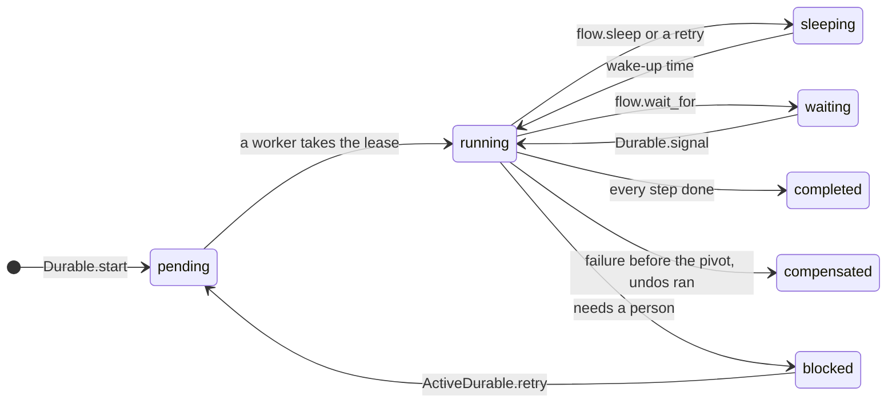

<p align="center">
  
</p>

<p align="center">
  <a href="https://github.com/williamromero/active_durable/actions/workflows/main.yml"></a>
  
  
  
  
  <a href="LICENSE.txt"></a>
</p>

<p align="center">
  <a href="#quick-start">Quick start</a> ·
  <a href="#how-it-works">How it works</a> ·
  <a href="#the-building-blocks">Building blocks</a> ·
  <a href="#dashboard">Dashboard</a> ·
  <a href="#testing-the-crash-tester">Crash tester</a> ·
  <a href="#compatibility">Compatibility</a>
</p>

---

A checkout reserves stock, charges a card, ships a parcel and sends an email. `ActiveRecord::Base.transaction`
can roll back your tables, but **a ROLLBACK cannot reach Stripe**. If the server dies after the charge, or the
carrier refuses the parcel, you end up with money taken and no order.

**ActiveDurable** turns that flow into a durable saga stored in your own database:

- **Nothing is done twice.** Every finished step is written down. After a crash, another worker continues where
  the first one stopped.
- **Nothing is left half done.** If a step fails for good, the steps that finished are undone, last one first.
- **Some things cannot be undone.** Mark the point of no return; after it, steps are retried instead.
- **Nothing extra to run.** Active Record and Active Job: no Redis, no workflow server.

## See it happen

<p align="center">
  
</p>

<p align="center">
  
</p>

## Quick start

```bash
bundle add active_durable
bin/rails generate active_durable:install
bin/rails db:migrate
```

Write the recipe once, in `app/sagas/`:

```ruby
# app/sagas/checkout_saga.rb
CheckoutSaga = Durable.define(:checkout) do |flow, order_id:|
  order = Order.find(order_id)

  # Touches only your database: committed together with its checkpoint, so it runs exactly once.
  flow.transaction(:reserve_stock, undo: ->(_) { order.release_stock! }) do
    order.reserve_stock!
    { "reserved" => true }
  end

  # Talks to the outside world: the ticket is an idempotency key that never changes for this step.
  payment = flow.step(:charge,
                      undo: lambda { |charge, ticket|
                        Stripe::Refund.create({ payment_intent: charge["id"] }, { idempotency_key: ticket })
                      }) do |ticket|
    intent = Stripe::PaymentIntent.create(
      { amount: order.total_cents, currency: "usd", customer: order.user.stripe_id, confirm: true },
      { idempotency_key: ticket }
    )
    { "id" => intent.id }
  end

  # The point of no return: before it failures are undone, after it steps are retried.
  flow.pivot(:dispatch) do |ticket|
    { "tracking" => Carrier.ship(order.id, reference: ticket).tracking_number, "payment" => payment["id"] }
  end

  flow.step(:confirmation_email) { OrderMailer.shipped(order.id).deliver_now && true }
  flow.sleep(:wait_for_delivery, 3.days) # no worker is held while it sleeps
  flow.step(:ask_for_review) { ReviewMailer.ask(order.id).deliver_now && true }
end
```

Start it in the same transaction that creates the order. The saga is saved with the order and the job is enqueued
only after the commit, so a crash in between cannot lose it:

```ruby
Order.transaction do
  order = Order.create!(order_params)
  Durable.start(:checkout, order_id: order.id)
end
```

Then schedule the sweeper, which picks up anything a crash left behind. With Solid Queue, in
`config/recurring.yml`:

```yaml
production:
  active_durable_sweep:
    class: ActiveDurable::SweepJob
    schedule: every minute
```

> `Durable` is a short alias for `ActiveDurable`. It is skipped if your app already defines a `Durable` constant.

## How it works

Every execution has a **notebook**: one row per step, with its status and its result. A worker takes the
execution with a lease, then runs the recipe from the top. For each step it looks at the notebook first:

| The notebook says | The worker |
| --- | --- |
| ✔ done | does not run the step and returns the recorded result |
| nothing yet | runs the step and writes the result down |
| retrying, failed or waiting | waits, retries, compensates or blocks, as described below |



Three rules follow from replaying the recipe:

1. **Everything that changes the world goes inside a step.** Code outside steps runs again on every replay:
   reading is fine; writing, charging or sending is not.
2. **Step results are JSON.** They come back from the notebook with string keys, and the first run returns the same
   JSON so it behaves exactly like a replay: `payment["id"]`, never `payment[:id]`.
3. **Step names are keys.** Each step needs a unique name within its recipe.

## The building blocks

| Call | Use it for | When it fails |
| --- | --- | --- |
| `flow.step(name) { \|ticket\| ... }` | anything that talks to the outside world | retried, then the saga is undone |
| `flow.transaction(name) { ... }` | changes to your own database only (exactly once) | rolled back with its checkpoint, retried, then undone |
| `flow.pivot(name) { \|ticket\| ... }` | the step after which there is no going back | retried, then the saga is undone |
| `flow.parallel(name) { \|branches\| ... }` | several steps at the same time | each branch like a step |
| `flow.sleep(name, 3.days)` | waiting without holding a worker | — |
| `flow.wait_for(name, timeout:)` | waiting for `Durable.signal` | a timeout fails the saga |

Steps take `undo:`, `retry:` (`3`, `false` or `{ attempts:, backoff: }`) and `undo_on_failure:`.

<details>
<summary><b>Tickets: a step that runs twice still has an effect once</b></summary>

<br>

Each step receives a ticket, `"<execution id>:<step name>"`, that is the same every time the step runs. If a worker
dies after calling Stripe but before writing the result down, the step runs again; with the ticket as the
idempotency key, Stripe answers with the first result instead of charging twice. Undos get their own ticket,
`"...:<step name>:undo"`.

</details>

<details>
<summary><b>Undo in reverse</b></summary>

<br>

When a step runs out of attempts, raises `ActiveDurable::Abort`, or the recipe raises, every finished step is undone,
last one first. Each undo is written in the notebook too, so a crash in the middle of undoing resumes where it
stopped. An undo receives `(result, undo_ticket, step_ticket)` and takes as many as it declares.

A step that failed is not undone, because it did not happen. The exception is a step whose failure may hide a
success, like a charge whose answer timed out: declare `undo_on_failure: true` and its undo runs with `nil` as the
result, so it can look the outcome up with the step's ticket.

To take another path instead, rescue the failure in the recipe:

```ruby
begin
  flow.step(:charge_with_stripe, retry: 2) { |ticket| ... }
rescue ActiveDurable::StepFailed
  flow.step(:charge_with_paypal) { |ticket| ... }
end
```

</details>

<details>
<summary><b>The point of no return</b></summary>

<br>

A shipped parcel or a wire transfer cannot be undone. Mark that step with `flow.pivot`. Before it, a failure undoes
everything. After it, steps cannot declare `undo:` and are retried with backoff (`config.after_pivot_attempts`,
25 by default); if they still fail, the execution is **blocked** for a person.

</details>

<details>
<summary><b>Sleeping and waiting for signals</b></summary>

<br>

`flow.sleep` writes the wake-up time down and releases the worker. `flow.wait_for` does the same until a signal
arrives. Signals can arrive before the saga starts waiting.

```ruby
kyc = flow.wait_for(:kyc_done, timeout: 2.hours)

# in the webhook controller
Durable.signal("loan-42", :kyc_done, verified: true)
```

Pass `id:` to `Durable.start` to choose the execution id (the call becomes idempotent).

</details>

<details>
<summary><b>Parallel branches</b></summary>

<br>

```ruby
reservations = flow.parallel(:reserve_stock) do |branches|
  order.warehouses.each do |warehouse|
    branches.step(warehouse.code, undo: ->(r, ticket) { warehouse.release(r["id"], key: ticket) }) do |ticket|
      { "id" => warehouse.reserve(order.items_for(warehouse), key: ticket) }
    end
  end
end
reservations # => { "MEX" => { "id" => ... }, "GDL" => { "id" => ... } }
```

Each branch runs in its own thread (`config.parallel_concurrency`, 4 by default), has its own notebook row
(`reserve_stock/MEX`), ticket and retries. After a crash only unfinished branches run again; if one fails for good,
the finished branches are undone in the order they finished. Give your connection pool at least
`parallel_concurrency + 1` connections.

</details>

<details>
<summary><b>Changing a recipe while sagas are in flight</b></summary>

<br>

If a replay reaches a step the notebook did not record, ActiveDurable blocks that execution with
`ActiveDurable::RecipeChanged` and names both steps, instead of guessing. To change a recipe safely, keep the old
one and add a version:

```ruby
CheckoutSaga = Durable.define(:checkout, version: 2) { |flow, order_id:| ... }
Durable.define(:checkout, version: 1) { |flow, order_id:| ... } # keep until nothing uses it
```

New executions use the highest version; each execution keeps the one it started with.
`bin/rails active_durable:versions` lists the versions unfinished executions still use.

</details>

## Dashboard

```ruby
# config/routes.rb
mount ActiveDurable::Engine => "/durable"
```

<table>
  <tr>
    <td width="50%"></td>
    <td width="50%"></td>
  </tr>
  <tr>
    <td colspan="2"></td>
  </tr>
</table>

Every saga is drawn as a row of blocks, and every animation means something: a running step beats, a waiting one
pings like a radar, a sleeping one fills a ring until it wakes, a failed one shakes, undone ones are striped and
wired backwards. Countdowns are live, and live mode refreshes the list and flashes the rows that changed. It has
buttons to retry, undo everything or run a saga again from a chosen step.

It needs no asset pipeline and works in `rails new --api` apps, with its own session for CSRF protection. Outside
development and test it stays **closed** until you decide who can open it:

```ruby
# config/initializers/active_durable.rb
ActiveDurable.config.dashboard_authorize = lambda do |controller|
  controller.authenticate_or_request_with_http_basic do |user, password|
    ActiveSupport::SecurityUtils.secure_compare(user, ENV.fetch("DURABLE_USER")) &
      ActiveSupport::SecurityUtils.secure_compare(password, ENV.fetch("DURABLE_PASSWORD"))
  end
end
```

## Operating sagas

```ruby
ActiveDurable.retry("checkout-7")                                   # blocked: try again where it stopped
ActiveDurable.compensate("checkout-7", reason: "customer cancelled") # undo everything (only before the pivot)
ActiveDurable.rerun("checkout-7", from: :ship)                      # a new execution reusing steps before :ship
```

All three refuse an execution a worker is running right now. A rerun runs the chosen step and the following ones
again with new tickets, so they have effects again; a blocked original becomes `superseded`.

## Testing: the crash tester

```ruby
require "active_durable/testing"

it "survives a crash at any point" do
  ActiveDurable::Testing.crash_everywhere(:checkout, order_id: order.id) do |execution, point|
    expect(execution.status).to eq("completed")
    expect(FakeStripe.charges.size).to eq(1)
  end
end
```

`crash_everywhere` runs the saga once to find every point where a process could die (before each step, after the
call but before the checkpoint, after the checkpoint, and the same for undos). Then it runs a fresh execution per
point, kills it right there, and finishes it with a new worker. It is the fastest way to find a step that is not
idempotent.

`ActiveDurable::Testing.drain(id, signals: { name => payload })` runs an execution synchronously, fast-forwarding
sleeps, retries and expired leases.

## Observability

<details>
<summary><b>Events and OpenTelemetry</b></summary>

<br>

Subscribe to `blocked.active_durable` to page someone:

```ruby
ActiveSupport::Notifications.subscribe("blocked.active_durable") do |event|
  Sentry.capture_message("Saga blocked", extra: event.payload)
end
```

| Event | Payload |
| --- | --- |
| `execution` / `step` / `compensation` / `undo` | `execution_id` (and `recipe`, `step`, `kind`) |
| `completed` / `compensated` | `execution_id`, `recipe` |
| `blocked` | `execution_id`, `recipe`, `error` |
| `retried` / `compensation_requested` / `rerun` | operator actions |

With `opentelemetry-sdk` configured, every worker run becomes a span with its steps, undos and compensation nested
inside, parallel branches included:

```ruby
require "active_durable/open_telemetry"
ActiveDurable::OpenTelemetry.install!
```

</details>

<details>
<summary><b>Configuration</b></summary>

<br>

```ruby
ActiveDurable.configure do |config|
  config.lease_duration = 5.minutes     # longer than your slowest step
  config.step_attempts = 3              # before the pivot, then undo
  config.after_pivot_attempts = 25      # after the pivot, then block
  config.undo_attempts = 10             # then block
  config.backoff = ->(attempt) { [2**attempt, 3600].min } # or [5, 30, 300], or a number
  config.parallel_concurrency = 4
  config.queue_name = :default
end
```

</details>

## Compatibility

Every combination below runs the full test suite in CI.

| | Rails 7.1 | Rails 7.2 | Rails 8.0 | Rails 8.1 |
| --- | :---: | :---: | :---: | :---: |
| **Ruby 3.1** | ✔ | ✔ | Rails 8 needs Ruby 3.2 | Rails 8 needs Ruby 3.2 |
| **Ruby 3.2** | ✔ | ✔ | ✔ | ✔ |
| **Ruby 3.3** | ✔ | ✔ | ✔ | ✔ |
| **Ruby 3.4** | ✔ | ✔ | ✔ | ✔ |
| **Ruby 4.0** | ✔ | ✔ | ✔ | ✔ |

Each one against **PostgreSQL**, **MySQL 8+** and **SQLite 3**. On Rails 7.1 and 8.0, keep `json` below 3 in your
app: Active Support 7.1 and 8.0 still pass an option that json 3 removed.

## How it compares

| | Keeps progress in | Undoes steps | Needs |
| --- | --- | --- | --- |
| Active Job Continuations (Rails 8.1) | the job (a cursor) | no | nothing extra |
| ChronoForge | your database | not in its docs | nothing extra |
| ruby_reactor | Redis | yes | Redis and Sidekiq |
| Temporal | the Temporal server | written by hand | a Temporal cluster |
| **ActiveDurable** | **your database** | **yes, in reverse, with a point of no return** | **nothing extra** |

## Guarantees and limits

- A step runs **at least once**; with an idempotency key it has its effect once. `flow.transaction` runs exactly
  once, because its change and its checkpoint commit together.
- One worker at a time per execution: taking an execution and every write are fenced by a lease token.
- Sagas do not isolate each other: two sagas can see each other's intermediate states.
- `flow.transaction` is atomic only when the notebook lives in the same database as your data.

## Development

```bash
bundle install
bundle exec rspec                                             # PostgreSQL, Rails 8.1
DB=mysql bundle exec rspec                                    # MySQL
DB=sqlite3 bundle exec rspec                                  # SQLite
BUNDLE_GEMFILE=gemfiles/rails-7.1.gemfile bundle exec rspec   # any Rails in gemfiles/
bundle exec rubocop
bin/demo                                                      # the dashboard with sample sagas
ruby docs/assets/generate.rb                                  # rebuild the animated SVGs of this README
```

The design notes, in Spanish, are in `docs/`.

## License

MIT. See [LICENSE.txt](LICENSE.txt).
