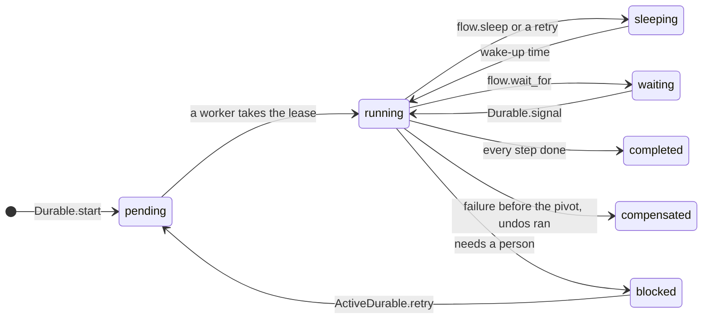
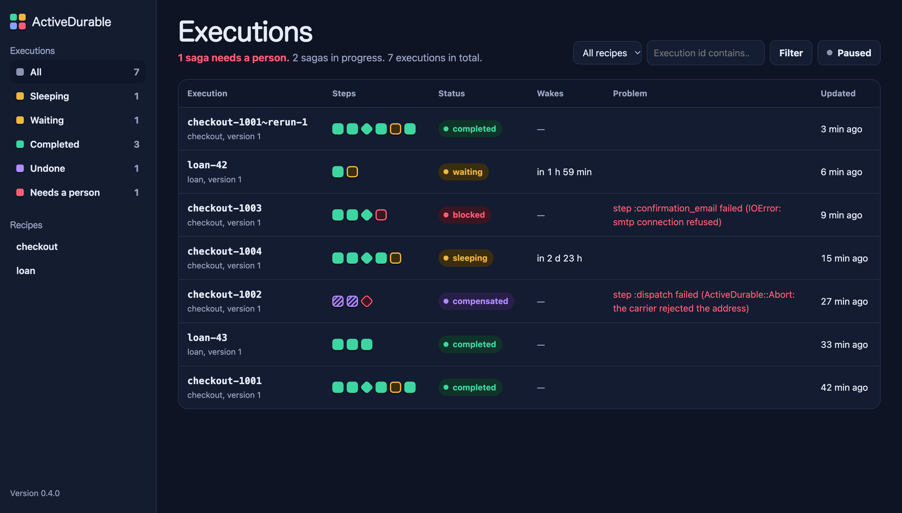
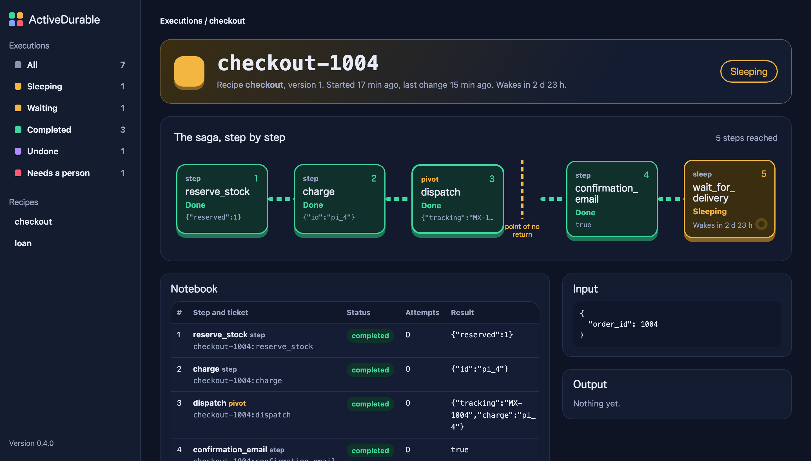
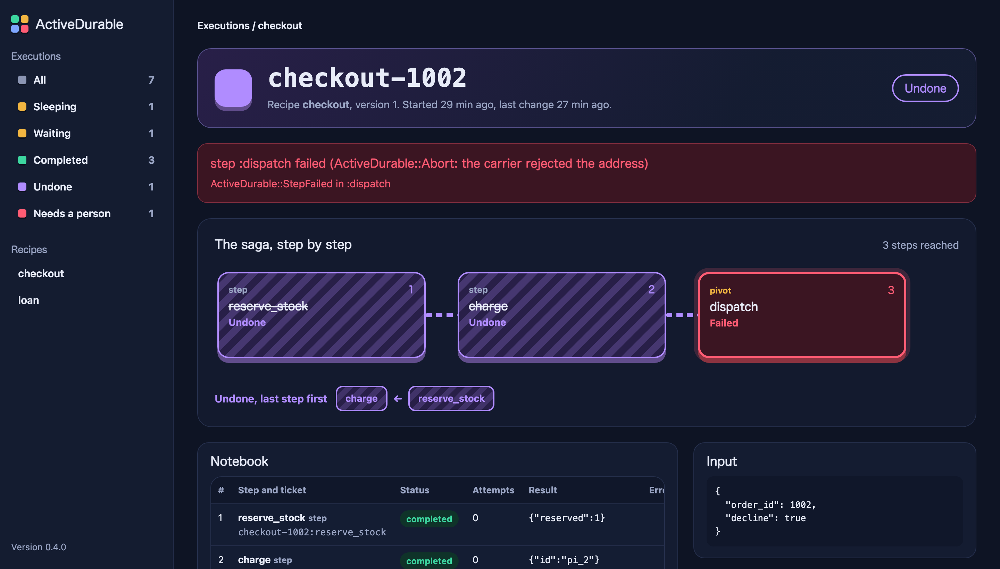

<p align="center"><b>English</b> · <a href="README.es.md">Español</a></p>

<p align="center">
  
</p>

<p align="center">
  <a href="https://github.com/webresstudio/active_durable/actions/workflows/main.yml"></a>
  
  
  
  
  <a href="LICENSE.txt"></a>
  <a href="https://webresstudio.github.io/active_durable/"></a>
</p>

<p align="center">
  <a href="https://webresstudio.github.io/active_durable/"><b>Website</b></a> ·
  <a href="#quick-start">Quick start</a> ·
  <a href="#in-a-rails-app">In a Rails app</a> ·
  <a href="#how-it-works">How it works</a> ·
  <a href="#the-building-blocks">Building blocks</a> ·
  <a href="#dashboard">Dashboard</a> ·
  <a href="#testing-the-crash-tester">Crash tester</a> ·
  <a href="#compatibility">Compatibility</a>
</p>

---

A checkout reserves stock, charges a card, ships a parcel and sends an email. `ActiveRecord::Base.transaction`
can roll back your tables, but **a ROLLBACK cannot reach Stripe**. If the server dies after the charge, or the
carrier refuses the parcel, you end up with money taken and no order.

**ActiveDurable** turns that flow into a durable saga stored in your own database:

- **Nothing is done twice.** Every finished step is written down. After a crash, another worker continues where
  the first one stopped.
- **Nothing is left half done.** If a step fails for good, the steps that finished are undone, last one first.
- **Some things cannot be undone.** Mark the point of no return; after it, steps are retried instead.
- **Nothing extra to run.** Active Record and Active Job: no Redis, no workflow server.

## See it happen

<p align="center">
  
</p>

<p align="center">
  
</p>

## Quick start

```bash
bundle add active_durable
bin/rails generate active_durable:install
bin/rails db:migrate
```

Write the recipe once, in `app/sagas/`:

```ruby
# app/sagas/checkout_saga.rb
CheckoutSaga = Durable.define(:checkout) do |flow, order_id:|
  order = Order.find(order_id)
  flow.on(:compensated) { order.update!(status: "cancelled") } # once every finished step was undone

  # Touches only your database: committed together with its checkpoint, so it runs exactly once.
  flow.transaction :reserve_stock, undo: -> { order.release_stock! } do
    order.reserve_stock!
    { "reserved" => true }
  end

  # Talks to the outside world: the ticket is an idempotency key that never changes for this step.
  payment = flow.step :charge, undo: ->(charge, ticket) { Payments.refund(charge, ticket) } do |ticket|
    Payments.charge(order, ticket)
  rescue Payments::CardDeclined => e
    flow.abort!(e.message) # a declined card is not retried: the stock is released right away
  end

  # The point of no return: before it failures are undone, after it steps are retried.
  flow.pivot :dispatch do |ticket|
    { "tracking" => Carrier.ship(order.id, reference: ticket).tracking_number, "payment" => payment["id"] }
  end
  flow.transaction(:mark_shipped) { order.update!(status: "shipped") } # your own status, for your pages

  flow.step(:confirmation_email) { OrderMailer.shipped(order.id).deliver_now && true }
  flow.sleep(:wait_for_delivery, 3.days) # no worker is held while it sleeps
  flow.step(:ask_for_review) { ReviewMailer.ask(order.id).deliver_now && true }
end
```

The calls to Stripe live in a plain module, doing and undoing side by side. The recipe hands them the ticket:

```ruby
# app/services/payments.rb
module Payments
  class CardDeclined < StandardError; end

  def self.charge(order, ticket)
    intent = Stripe::PaymentIntent.create(
      { amount: order.total_cents, currency: "usd", customer: order.user.stripe_id, confirm: true },
      { idempotency_key: ticket }
    )
    { "id" => intent.id } # written in the notebook, so it must fit in JSON
  rescue Stripe::CardError => e
    raise CardDeclined, e.message # the recipe speaks your language, not Stripe's
  end

  def self.refund(charge, ticket)
    Stripe::Refund.create({ payment_intent: charge["id"] }, { idempotency_key: ticket })
  end
end
```

Start it in the same transaction that creates the order. The saga is saved with the order and the job is enqueued
only after the commit, so a crash in between cannot lose it:

```ruby
Order.transaction do
  order = Order.create!(order_params)
  Durable.start(:checkout, order_id: order.id)
end
```

To run it for real, with a job backend, the sweeper, the initializer, the dashboard and tests, follow
[In a Rails app](#in-a-rails-app).

> `Durable` is a short alias for `ActiveDurable`. It is skipped if your app already defines a `Durable` constant.

## In a Rails app

Everything a Rails app needs, in order. Steps 1 to 5 are done once; step 6 is the code you write for each saga.

### 1. Install

Run the three commands from the [quick start](#quick-start). The migration creates `durable_executions`,
`durable_steps` and `durable_signals` in your **primary database**, next to your models: `flow.transaction` runs
exactly once only because the notebook and your data commit together. A queue in its own database, like Solid
Queue's in Rails 8, is fine.

### 2. A job backend

ActiveDurable runs on Active Job, so it uses the backend you already have. New Rails 8 apps come with Solid Queue;
on older apps, `bundle add solid_queue` and `bin/rails solid_queue:install` write these lines. With Sidekiq or
GoodJob, set their adapter instead.

```ruby
# config/environments/production.rb
config.active_job.queue_adapter = :solid_queue
config.solid_queue.connects_to = { database: { writing: :queue } }
```

- **Workers must listen to the saga queue.** It is `:default` unless you change `config.queue_name`; if you do, add
  it to your workers (Solid Queue's `config/queue.yml`, Sidekiq's `-q`).
- **In development** Rails' default `:async` adapter keeps each job in the memory of the process that enqueued it.
  The server runs its own, sleeps and retries included, but a saga started from the console, `bin/rails runner`, a
  rake task or `db/seeds.rb` is lost when that process exits, and scheduled wake-ups are lost when the server
  restarts. A minute later, `bin/rails active_durable:sweep` picks them up: with `:async` it runs them right there.
  Or run Solid Queue in development too, with `bin/jobs` next to the server.

### 3. The sweeper

The safety net: every minute it enqueues executions that lost their job, because the process died between the
commit and the enqueue or a worker died holding a lease. With Solid Queue:

```yaml
# config/recurring.yml
production:
  active_durable_sweep:
    class: ActiveDurable::SweepJob
    schedule: every minute
```

With another backend, schedule `ActiveDurable::SweepJob` in its own scheduler (GoodJob cron, sidekiq-cron), or run
`bin/rails active_durable:sweep` from cron.

### 4. The initializer

The settings, with their defaults:

```ruby
# config/initializers/active_durable.rb
ActiveDurable.configure do |config|
  config.queue_name = :default          # the queue of ActiveDurable::RunJob and SweepJob
  config.lease_duration = 5.minutes     # longer than your slowest step
  config.step_attempts = 3              # before the pivot, then undo
  config.after_pivot_attempts = 25      # after the pivot, then block
  config.undo_attempts = 10             # then block
  config.backoff = ->(attempt) { [2**attempt, 3600].min } # or [5, 30, 300], or a number
  config.parallel_concurrency = 4       # threads per flow.parallel
  config.sweep_grace = 1.minute         # the sweeper leaves executions this young alone

  # Who may open the dashboard outside development and test. With Devise (HTTP basic auth: see Dashboard):
  config.dashboard_authorize = ->(controller) { controller.request.env["warden"]&.user&.admin? }
end

# Tell someone when a saga needs a person.
ActiveSupport::Notifications.subscribe("blocked.active_durable") do |event|
  Sentry.capture_message("Saga blocked", extra: event.payload)
end
```

For traces, see [OpenTelemetry](#observability).

### 5. Routes

```ruby
# config/routes.rb
mount ActiveDurable::Engine => "/durable"
```

### 6. Your code

Each recipe lives in `app/sagas/<name>_saga.rb` and is assigned to `<Name>Saga`, so a worker can load
`:checkout` from `CheckoutSaga` by its name.

```text
app/
  sagas/checkout_saga.rb            the recipe
  services/payments.rb              charge and refund, side by side
  services/place_order.rb           creates the order and starts the saga
  controllers/orders_controller.rb  calls PlaceOrder and answers right away
```

The controller never calls Stripe. It starts the saga and answers at once; a job runs the steps.

```ruby
# app/services/place_order.rb
class PlaceOrder
  def self.call(params)
    Order.transaction do
      order = Order.create!(params)
      Durable.start(:checkout, id: "checkout-#{order.id}", order_id: order.id)
      order
    end
  end
end

# app/controllers/orders_controller.rb
class OrdersController < ApplicationController
  def create
    redirect_to PlaceOrder.call(order_params)
  end

  def show
    @order = Order.find(params[:id])
  end
end

# app/models/order.rb
class Order < ApplicationRecord
  def checkout
    Durable.find("checkout-#{id}")
  end
end
```

The `id:` ties the saga to its order: `order.checkout` is for your team and the dashboard. The page shows the order's
own status, which the saga writes as it goes (`mark_shipped`, `flow.on(:compensated)`), not the saga's: a shipped
order still has a saga sleeping three days before it asks for a review.

```erb
<%# app/views/orders/show.html.erb %>
<% case @order.status %>
<% when "shipped" %>   Your order is on its way.
<% when "cancelled" %> We could not complete it and refunded you.
<% else %>             Processing…
<% end %>
```

The customer does not see "card declined" in the same response: the page says "Processing…" and updates itself
with polling or Turbo Streams. In exchange, nobody is ever charged for half an order.

### 7. The job

You do not write one. Once the transaction commits, ActiveDurable enqueues its own `ActiveDurable::RunJob` with the
execution id, on the Active Job backend you already use (Solid Queue, Sidekiq, GoodJob…). Every time the saga wakes
up, after a sleep, a retry or a signal, it enqueues that job again. Retries belong to each step and are written in
the notebook, not to the job: if your backend retries the job too, the copy finds the lease taken and returns.

| You want to | Do this |
| --- | --- |
| choose the queue | `config.queue_name = :sagas` |
| set a priority or other job options | the same as for any job, in an initializer: `ActiveDurable::RunJob.queue_with_priority 10` |
| retry a step more or fewer times | `retry:` on the step, or `config.step_attempts` |
| stop retrying a business failure | `flow.abort!`, like the declined card above |
| see what is running | the [dashboard](#dashboard), or `ActiveDurable::RunJob` in your backend's UI |
| hear about a stuck saga | the `blocked.active_durable` [event](#observability) |
| run a saga inline in tests | `ActiveDurable::Testing.drain(id)` |
| start or wake sagas from your own jobs | call `Durable.start` or `Durable.signal` there |

> Do not wrap `Durable.start` in a job of your own. The order and its saga would no longer be saved together, and a
> crash between the two would leave an order without a saga.

### 8. Tests

```ruby
# spec/rails_helper.rb
require "active_durable/testing"

RSpec.configure do |config|
  config.before { ActiveDurable::Testing.reset! } # forgets simulated time and crash hooks
end
```

```ruby
# spec/services/place_order_spec.rb
it "charges once and confirms the order" do
  order = PlaceOrder.call(order_params)

  expect(ActiveDurable::Testing.drain(order.checkout.id).status).to eq("completed")
end
```

With Minitest, the Rails default:

```ruby
# test/test_helper.rb
require "active_durable/testing"

class ActiveSupport::TestCase
  setup { ActiveDurable::Testing.reset! }
end

# test/services/place_order_test.rb
class PlaceOrderTest < ActiveSupport::TestCase
  test "charges once and confirms the order" do
    order = PlaceOrder.call(email: "ana@example.com", total_cents: 4200)

    assert_equal "completed", ActiveDurable::Testing.drain(order.checkout.id).status
  end
end
```

`drain` runs the saga right there, without a worker. Stub Stripe as you already do, then let the
[crash tester](#testing-the-crash-tester) kill the saga at every point.

### 9. Before going to production

- [ ] Workers are running and listen to `config.queue_name`.
- [ ] The sweeper runs every minute.
- [ ] `dashboard_authorize` is set; without it the dashboard answers 403.
- [ ] `lease_duration` is longer than your slowest step.
- [ ] Every step that calls an outside service passes the ticket as its idempotency key.
- [ ] The crash tester passes for every recipe.

## How it works

Every execution has a **notebook**: one row per step, with its status and its result. A worker takes the
execution with a lease, then runs the recipe from the top. For each step it looks at the notebook first:

| The notebook says | The worker |
| --- | --- |
| ✔ done | does not run the step and returns the recorded result |
| nothing yet | runs the step and writes the result down |
| retrying, failed or waiting | waits, retries, compensates or blocks, as described below |



Three rules follow from replaying the recipe:

1. **Everything that changes the world goes inside a step.** Code outside steps runs again on every replay:
   reading is fine; writing, charging or sending is not.
2. **Step results are JSON.** They come back from the notebook with string keys, and the first run returns the same
   JSON so it behaves exactly like a replay: `payment["id"]`, never `payment[:id]`.
3. **Step names are keys.** Each step needs a unique name within its recipe.

## The building blocks

| Call | Use it for | When it fails |
| --- | --- | --- |
| `flow.step(name) { \|ticket\| ... }` | anything that talks to the outside world | retried, then the saga is undone |
| `flow.transaction(name) { ... }` | changes to your own database only (exactly once) | rolled back with its checkpoint, retried, then undone |
| `flow.pivot(name) { \|ticket\| ... }` | the step after which there is no going back | retried, then the saga is undone |
| `flow.parallel(name) { \|branches\| ... }` | several steps at the same time | each branch like a step |
| `flow.sleep(name, 3.days)` | waiting without holding a worker | — |
| `flow.wait_for(name, timeout:)` | waiting for `Durable.signal` | a timeout fails the saga |
| `flow.on(:completed) { ... }` | updating your own records when the saga ends (also `:compensated`) | blocks; a retry runs the hook again |

Steps take `undo:`, `retry:` (`3`, `false` or `{ attempts:, backoff: }`) and `undo_on_failure:`.

<details>
<summary><b>Tickets: a step that runs twice still has an effect once</b></summary>

<br>

Each step receives a ticket, `"<execution id>:<step name>"`, that is the same every time the step runs. If a worker
dies after calling Stripe but before writing the result down, the step runs again; with the ticket as the
idempotency key, Stripe answers with the first result instead of charging twice. Undos get their own ticket,
`"...:<step name>:undo"`.

</details>

<details>
<summary><b>Undo in reverse</b></summary>

<br>

When a step runs out of attempts or calls `flow.abort!`, every finished step is undone, last one first. Each undo is written in the notebook too, so a crash in the middle of undoing resumes where it
stopped. An undo receives `(result, undo_ticket, step_ticket)` and takes as many as it declares: `-> { ... }` takes
none. Any object that responds to `call` works too, such as `Payments.method(:refund)`.

**A bug is not a failure.** Anything else the recipe raises, and a `NameError` or `NoMethodError` inside a step,
blocks the execution instead of undoing it: a typo in a deploy must never refund your customers. Fix the code and
call `ActiveDurable.retry(id)`, or press Retry in the dashboard, and the saga carries on from where it stopped. To
reject the work for a business reason outside a step, call `flow.abort!(reason)`.

A step that failed is not undone, because it did not happen. The exception is a step whose failure may hide a
success, like a charge whose answer timed out: declare `undo_on_failure: true` and its undo runs with `nil` as the
result, so it can look the outcome up with the step's ticket.

To take another path instead, rescue the failure in the recipe:

```ruby
begin
  flow.step(:charge_with_stripe, retry: 2) { |ticket| ... }
rescue ActiveDurable::StepFailed
  flow.step(:charge_with_paypal) { |ticket| ... }
end
```

</details>

<details>
<summary><b>The point of no return</b></summary>

<br>

A shipped parcel or a wire transfer cannot be undone. Mark that step with `flow.pivot`. Before it, a failure undoes
everything. After it, steps cannot declare `undo:` and are retried with backoff (`config.after_pivot_attempts`,
25 by default); if they still fail, the execution is **blocked** for a person.

</details>

<details>
<summary><b>When a saga ends: hooks</b></summary>

<br>

`flow.on(:completed)` and `flow.on(:compensated)` run once the saga ends that way, to update your own records:

```ruby
CheckoutSaga = Durable.define(:checkout) do |flow, order_id:|
  order = Order.find(order_id)
  flow.on(:completed) { order.update!(status: "delivered") }
  flow.on(:compensated) { order.update!(status: "cancelled") }

  flow.transaction(:reserve_stock, undo: -> { order.release_stock! }) { ... }
end
```

Declare them before the first step: a saga undone at its first step never reaches the lines after it. `completed`
runs after the last step and `compensated` after the last undo, each in a transaction together with the notebook
entry that records it, so a hook that only touches your database runs exactly once, even if the process dies. If a
hook raises, the execution is blocked, and `ActiveDurable.retry` runs the hook again, not the steps.

For progress before the end (paid, shipped), write a step: `flow.transaction(:mark_shipped) { ... }`.

</details>

<details>
<summary><b>Sleeping and waiting for signals</b></summary>

<br>

`flow.sleep` writes the wake-up time down and releases the worker. `flow.wait_for` does the same until a signal
arrives. Signals can arrive before the saga starts waiting.

```ruby
kyc = flow.wait_for(:kyc_done, timeout: 2.hours)

# in the webhook controller
Durable.signal("loan-42", :kyc_done, verified: true)
```

Pass `id:` to `Durable.start` to choose the execution id (the call becomes idempotent).

</details>

<details>
<summary><b>Parallel branches</b></summary>

<br>

```ruby
reservations = flow.parallel :reserve_stock do |branches|
  order.warehouses.each do |warehouse|
    branches.step warehouse.code, undo: ->(r, ticket) { warehouse.release(r["id"], key: ticket) } do |ticket|
      { "id" => warehouse.reserve(order.items_for(warehouse), key: ticket) }
    end
  end
end
reservations # => { "MEX" => { "id" => ... }, "GDL" => { "id" => ... } }
```

Each branch runs in its own thread (`config.parallel_concurrency`, 4 by default), has its own notebook row
(`reserve_stock/MEX`), ticket and retries. After a crash only unfinished branches run again; if one fails for good,
the finished branches are undone in the order they finished. Give your connection pool at least
`parallel_concurrency + 1` connections.

</details>

<details>
<summary><b>Changing a recipe while sagas are in flight</b></summary>

<br>

If a replay reaches a step the notebook did not record, ActiveDurable blocks that execution with
`ActiveDurable::RecipeChanged` and names both steps, instead of guessing. To change a recipe safely, keep the old
one and add a version:

```ruby
CheckoutSaga = Durable.define(:checkout, version: 2) { |flow, order_id:| ... }
Durable.define(:checkout, version: 1) { |flow, order_id:| ... } # keep until nothing uses it
```

New executions use the highest version; each execution keeps the one it started with.
`bin/rails active_durable:versions` lists the versions unfinished executions still use.

</details>

## Dashboard

```ruby
# config/routes.rb
mount ActiveDurable::Engine => "/durable"
```

<table>
  <tr>
    <td width="50%"></td>
    <td width="50%"></td>
  </tr>
  <tr>
    <td colspan="2"></td>
  </tr>
</table>

Every saga is drawn as a row of blocks, and every animation means something: a running step beats, a waiting one
pings like a radar, a sleeping one fills a ring until it wakes, a failed one shakes, undone ones are striped and
wired backwards. Countdowns are live, and live mode refreshes the list and flashes the rows that changed. It has
buttons to retry, undo everything or run a saga again from a chosen step.

It needs no asset pipeline and works in `rails new --api` apps, with its own session for CSRF protection. Outside
development and test it stays **closed** until you decide who can open it:

```ruby
# config/initializers/active_durable.rb
ActiveDurable.config.dashboard_authorize = lambda do |controller|
  controller.authenticate_or_request_with_http_basic do |user, password|
    ActiveSupport::SecurityUtils.secure_compare(user, ENV.fetch("DURABLE_USER")) &
      ActiveSupport::SecurityUtils.secure_compare(password, ENV.fetch("DURABLE_PASSWORD"))
  end
end
```

## Operating sagas

```ruby
ActiveDurable.retry("checkout-7")                                   # blocked: try again where it stopped
ActiveDurable.compensate("checkout-7", reason: "customer cancelled") # undo everything (only before the pivot)
ActiveDurable.rerun("checkout-7", from: :ship)                      # a new execution reusing steps before :ship
```

All three refuse an execution a worker is running right now. A rerun runs the chosen step and the following ones
again with new tickets, so they have effects again; a blocked original becomes `superseded`.

## Testing: the crash tester

```ruby
require "active_durable/testing"

it "survives a crash at any point" do
  ActiveDurable::Testing.crash_everywhere(:checkout, order_id: order.id) do |execution, point|
    expect(execution.status).to eq("completed")
    expect(FakeStripe.charges.size).to eq(1)
  end
end
```

`crash_everywhere` runs the saga once to find every point where a process could die (before each step, after the
call but before the checkpoint, after the checkpoint, and the same for undos). Then it runs a fresh execution per
point, kills it right there, and finishes it with a new worker. It is the fastest way to find a step that is not
idempotent.

`ActiveDurable::Testing.drain(id, signals: { name => payload })` runs an execution synchronously, fast-forwarding
sleeps, retries and expired leases.

## Observability

<details>
<summary><b>Events and OpenTelemetry</b></summary>

<br>

Subscribe to `blocked.active_durable` to page someone:

```ruby
ActiveSupport::Notifications.subscribe("blocked.active_durable") do |event|
  Sentry.capture_message("Saga blocked", extra: event.payload)
end
```

| Event | Payload |
| --- | --- |
| `execution` / `step` / `compensation` / `undo` / `hook` | `execution_id` (and `recipe`, `step`, `kind`) |
| `completed` / `compensated` | `execution_id`, `recipe` |
| `blocked` | `execution_id`, `recipe`, `error` |
| `retried` / `compensation_requested` / `rerun` | operator actions |

With `opentelemetry-sdk` configured, every worker run becomes a span with its steps, undos and compensation nested
inside, parallel branches included:

```ruby
require "active_durable/open_telemetry"
ActiveDurable::OpenTelemetry.install!
```

</details>

The settings are in [the initializer](#4-the-initializer).

## Compatibility

Every combination below runs the full test suite in CI, against **PostgreSQL**, **MySQL 8+** and **SQLite 3**.

| | Rails 6.1 | Rails 7.0 | Rails 7.1 | Rails 7.2 | Rails 8.0 | Rails 8.1 |
| --- | :---: | :---: | :---: | :---: | :---: | :---: |
| **Ruby 3.1** | ✔ | ✔ | ✔ | ✔ | needs Ruby 3.2 | needs Ruby 3.2 |
| **Ruby 3.2** | ✔ | ✔ | ✔ | ✔ | ✔ | ✔ |
| **Ruby 3.3** | ✔ | ✔ | ✔ | ✔ | ✔ | ✔ |
| **Ruby 3.4** | ✔ | ✔ | ✔ | ✔ | ✔ | ✔ |
| **Ruby 4.0** | ✔ | ✔ | ✔ | ✔ | ✔ | ✔ |

Every feature works on every version. Things your app may need on older Rails, unrelated to ActiveDurable:

- **MySQL on Rails 6.1 and 7.0** uses the `mysql2` adapter (`trilogy` ships with Active Record 7.1+).
- **Rails 6.1 on Ruby 3.4+** needs `base64`, `benchmark`, `bigdecimal`, `drb`, `logger`, `mutex_m`, `observer`
  and `ostruct` in the Gemfile: Rails 6.1 uses them, and Ruby no longer ships them by default.
- **`unknown keyword: quirks_mode`** comes from some Active Support versions (seen with 7.1 and 8.0) and json 3:
  add `gem "json", "< 3"`.

## How it compares

| | Keeps progress in | Undoes steps | Needs |
| --- | --- | --- | --- |
| Active Job Continuations (Rails 8.1) | the job (a cursor) | no | nothing extra |
| ChronoForge | your database | not in its docs | nothing extra |
| ruby_reactor | Redis | yes | Redis and Sidekiq |
| Temporal | the Temporal server | written by hand | a Temporal cluster |
| **ActiveDurable** | **your database** | **yes, in reverse, with a point of no return** | **nothing extra** |

## Guarantees and limits

- A step runs **at least once**; with an idempotency key it has its effect once. `flow.transaction` runs exactly
  once, because its change and its checkpoint commit together.
- One worker at a time per execution: taking an execution and every write are fenced by a lease token.
- Sagas do not isolate each other: two sagas can see each other's intermediate states.
- `flow.transaction` is atomic only when the notebook lives in the same database as your data.

## Development

```bash
bundle install
bundle exec rspec                                             # PostgreSQL, Rails 8.1
DB=mysql bundle exec rspec                                    # MySQL
DB=sqlite3 bundle exec rspec                                  # SQLite
BUNDLE_GEMFILE=gemfiles/rails-7.1.gemfile bundle exec rspec   # any Rails in gemfiles/
bundle exec rubocop
bin/demo                                                      # the dashboard with sample sagas
ruby docs/assets/generate.rb                                  # rebuild the animated SVGs of this README
```

This README exists in two languages: every change goes to `README.md` and `README.es.md` (see `CONTRIBUTING.md`).
The design notes, in Spanish, are in `docs/`.

## License

MIT. See [LICENSE.txt](LICENSE.txt).
